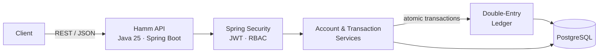
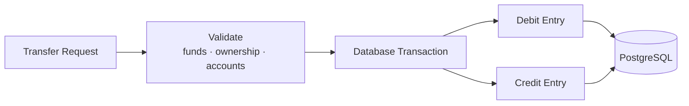

# Hamm

Hamm is a secure financial ledger API for transactional account workflows with double-entry accounting, atomic transfers, and role-based access control.


## Tech stack

- Java 25 (backend)
- Spring Boot (REST API)
- Spring Security + JWT (authentication and authorization)
- Spring Data JPA (persistence)
- PostgreSQL (transactional ledger)
- H2 (local integration testing)
- Testcontainers (PostgreSQL integration testing)
- Swagger / OpenAPI (API documentation)
- Docker + Docker Compose (containerization)
- GitHub Actions (CI)

## Architecture



## Features

- JWT-based stateless authentication
- role-based authorization for customers, accountants, auditors, and admins
- account creation and management
- deposits, withdrawals, and transfers
- double-entry ledger for financial transactions
- immutable ledger entries with reversal-based corrections
- atomic database transactions with rollback on failure
- account locking to prevent concurrent balance updates
- PostgreSQL constraints and indexes
- request and business-rule validation
- consistent API error responses
- Swagger/OpenAPI documentation
- Dockerized local environment
- automated unit and integration tests

## Ledger design

Hamm uses double-entry accounting. Each transfer produces corresponding debit and credit ledger entries rather than representing a transfer as a single balance mutation.



Ledger entries are immutable. Corrections are represented by reversal transactions rather than modifying historical entries.

A transaction records:

- source and destination accounts
- transaction reference
- amount
- entry type
- resulting balance
- timestamp
- initiating user

## Security

Hamm secures endpoints with Spring Security and JWT authentication.

### Authentication

- user registration and login
- BCrypt password hashing
- JWT generation and validation
- stateless authentication
- protected endpoints by default

### Authorization

Roles:

- `CUSTOMER`
- `ACCOUNTANT`
- `AUDITOR`
- `ADMIN`

Method-level authorization and ownership validation restrict access to account and transaction operations.

## Transaction safety

Financial operations execute inside Spring-managed database transactions.

Transfers validate:

- amount is positive
- source and destination accounts differ
- both accounts are active
- the source account has sufficient funds
- the transaction reference is unique
- the requesting user is authorized

Account locking prevents concurrent operations from producing inconsistent balances. Failed operations roll back without leaving partial ledger entries.

## API

### Authentication

```text
POST /api/v1/auth/register
POST /api/v1/auth/login
```

### Accounts

```text
POST  /api/v1/accounts
GET   /api/v1/accounts
GET   /api/v1/accounts/{id}
PATCH /api/v1/accounts/{id}
GET   /api/v1/accounts/{id}/balance
GET   /api/v1/accounts/{id}/entries
```

### Transactions

```text
POST /api/v1/transactions/deposit
POST /api/v1/transactions/withdraw
POST /api/v1/transactions/transfer
GET  /api/v1/transactions
GET  /api/v1/transactions/{id}
```

Full request and response documentation is available through Swagger UI while the application is running.

## Getting started

Requires Java 25, Docker, and Docker Compose.

Run the API and PostgreSQL together:

```bash
docker compose up --build
```

Or run PostgreSQL separately and start the API with Maven:

```bash
docker compose up db
./mvnw spring-boot:run
```

Once running:

| Service | URL |
|---|---|
| API | http://localhost:8080/api/v1 |
| Swagger UI | http://localhost:8080/swagger-ui/index.html |
| Health check | http://localhost:8080/actuator/health |

## Try it

Register a user:

```bash
curl -X POST http://localhost:8080/api/v1/auth/register \
  -H "Content-Type: application/json" \
  -d '{"email":"jane@example.com","password":"password123","fullName":"Jane Doe"}'
```

Copy the `accessToken` from the response and create an account:

```bash
curl -X POST http://localhost:8080/api/v1/accounts \
  -H "Content-Type: application/json" \
  -H "Authorization: Bearer <token>" \
  -d '{"currency":"USD"}'
```

## Database

The PostgreSQL data model centers around five domain concepts:

```text
User
 └── Account
      └── LedgerEntry
            │
            └── Transaction
```

Core entities:

- `User`
- `Role`
- `Account`
- `Transaction`
- `LedgerEntry`

The schema enforces constraints for:

- positive transaction amounts
- unique account numbers
- unique transaction reference IDs
- foreign-key relationships
- timestamp auditing

Indexes cover common account, transaction-reference, and chronological lookup patterns.

## Validation and errors

Requests use Bean Validation for structural validation such as required fields, positive amounts, currency codes, and description lengths.

The service layer additionally enforces business rules such as account ownership, sufficient funds, active-account status, duplicate references, and self-transfer prevention.

A global exception handler returns consistent JSON responses for validation, authorization, missing resources, insufficient funds, and duplicate transactions.

## Testing

Run the test suite:

```bash
./mvnw test
```

Tests cover:

- authentication and JWT validation
- authorization
- account creation
- deposits
- withdrawals
- transfers
- insufficient funds
- validation failures
- double-entry ledger creation
- transactional rollback

H2-backed integration tests run locally without Docker.

A separate Testcontainers suite runs the same workflows against a real PostgreSQL container. It automatically skips when Docker is unavailable locally and runs in CI where Docker is available.

## Configuration

Application configuration lives in:

```text
src/main/resources/application.yml
```

Settings can be overridden through environment variables:

```text
DB_HOST
DB_PORT
DB_NAME
DB_USERNAME
DB_PASSWORD
JWT_SECRET
JWT_EXPIRATION_MS
SERVER_PORT
```

The values used by Docker Compose are defined in `docker-compose.yml`.

> The default JWT secret is intended for local development only. Set a secure `JWT_SECRET` before deploying Hamm outside a local environment.

## Project structure

```text
src/main/java/com/example/hamm/
├── auth/
├── account/
├── transaction/
├── ledger/
├── user/
├── security/
├── exception/
├── config/
├── dto/
├── repository/
├── service/
├── controller/
└── mapper/
```

## CI

GitHub Actions automatically:

- builds the project
- runs unit tests
- runs PostgreSQL integration tests
- packages the application
- builds the Docker image
